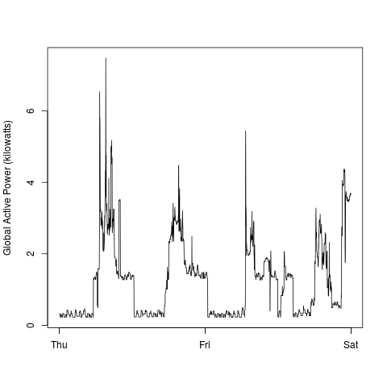
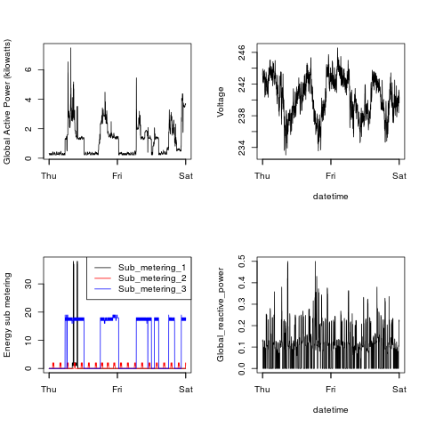

Alexa Rosalsky 

September 2015

# Plotting Household Energy Usage
This is the first project for Exploratory Data Analysis course.

## Introduction

This assignment uses data from
the <a href="http://archive.ics.uci.edu/ml/">UC Irvine Machine
Learning Repository</a>, a popular repository for machine learning
datasets. In particular, we will be using the "Individual household
electric power consumption Data Set" which I have made available on
the course web site:


* <b>Dataset</b>: <a href="https://d396qusza40orc.cloudfront.net/exdata%2Fdata%2Fhousehold_power_consumption.zip">Electric power consumption</a> [20Mb]

* <b>Description</b>: Measurements of electric power consumption in
one household with a one-minute sampling rate over a period of almost
4 years. Different electrical quantities and some sub-metering values
are available.


The following descriptions of the 9 variables in the dataset are taken
from
the <a href="https://archive.ics.uci.edu/ml/datasets/Individual+household+electric+power+consumption">UCI
web site</a>:

<ol>
<li><b>Date</b>: Date in format dd/mm/yyyy </li>
<li><b>Time</b>: time in format hh:mm:ss </li>
<li><b>Global_active_power</b>: household global minute-averaged active power (in kilowatt) </li>
<li><b>Global_reactive_power</b>: household global minute-averaged reactive power (in kilowatt) </li>
<li><b>Voltage</b>: minute-averaged voltage (in volt) </li>
<li><b>Global_intensity</b>: household global minute-averaged current intensity (in ampere) </li>
<li><b>Sub_metering_1</b>: energy sub-metering No. 1 (in watt-hour of active energy). It corresponds to the kitchen, containing mainly a dishwasher, an oven and a microwave (hot plates are not electric but gas powered). </li>
<li><b>Sub_metering_2</b>: energy sub-metering No. 2 (in watt-hour of active energy). It corresponds to the laundry room, containing a washing-machine, a tumble-drier, a refrigerator and a light. </li>
<li><b>Sub_metering_3</b>: energy sub-metering No. 3 (in watt-hour of active energy). It corresponds to an electric water-heater and an air-conditioner.</li>
</ol>

## Loading and processing the data


```r
pc <- read.table("~/Documents/R_Stuff/household_power_consumption.txt", sep = ";", header = TRUE, 
                 stringsAsFactors = FALSE, colClasses  = c("character", "character", "numeric", "numeric", 
                "numeric", "numeric", "numeric", "numeric", "numeric"), na.strings = "?")

pc$Date <- as.Date(pc$Date, format = "%d/%m/%Y")
pc <- pc[(pc$Date=="2007-02-01") | (pc$Date=="2007-02-02"),]

pc <- transform(pc, datetime=as.POSIXct(paste(Date, Time), format = "%Y-%m-%d %H:%M:%S"))
```


### Plot 1

```r
png("plot1.png", width = 480, height = 480)
hist(pc$Global_active_power, xlab = "Global Active Power (kilowatts)", col = "red", main = "Global Active Power")
dev.off()
```


### Plot 2

```r
png("plot2.png", width = 480, height = 480)
plot(pc$datetime, pc$Global_active_power, type = "l", ylab = "Global Active Power (kilowatts)", xlab = "")
dev.off()
```


### Plot 3

```r
png("plot3.png", width = 480, height = 480)
plot(pc$datetime, pc$Sub_metering_1, type = "l", ylab = "Energy sub metering", xlab = "")
lines(pc$datetime, pc$Sub_metering_2, col = "red")
lines(pc$datetime, pc$Sub_metering_3, col = "blue")
legend("topright", col=c("black","red","blue"), c("Sub_metering_1","Sub_metering_2", "Sub_metering_3"), 
       lty=c(1,1), lwd=c(1,1))
dev.off()
```


### Plot 4

```r
png("plot4.png", width = 480, height = 480)
par(mfrow=c(2,2))

# plot 1
plot(pc$datetime, pc$Global_active_power, type = "l", ylab = "Global Active Power (kilowatts)", xlab = "")

# plot 2
plot(pc$datetime, pc$Voltage, type="l", xlab="datetime", ylab="Voltage")

# plot 3
plot(pc$datetime, pc$Sub_metering_1, type = "l", ylab = "Energy sub metering", xlab = "")
lines(pc$datetime, pc$Sub_metering_2, col = "red")
lines(pc$datetime, pc$Sub_metering_3, col = "blue")
legend("topright", col=c("black","red","blue"), c("Sub_metering_1","Sub_metering_2", "Sub_metering_3"), 
       lty=c(1,1), lwd=c(1,1))

# plot 4
plot(pc$datetime,pc$Global_reactive_power, type="l", xlab="datetime", 
     ylab="Global_reactive_power")
dev.off()
```
 
